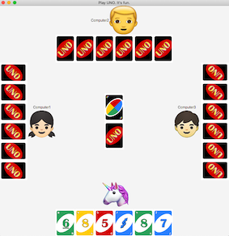

# Uno Game

A Java FX implementation of the card game uno. This was my project in an Object Oriented Programming Java Class with focus on clean coding.   





## Installation

```
git clone https://github.com/jorgebmann/javafx_unogame
```
Images of cards and players are included. Read java doc for more information.

## Usage

Run frontend/UnoFXAllInOne.java 

If you are using a Mac make sure to un-mark the "Use the -XstartOnFirstThread argument when launching with SWT" in 
Run Configurations => Arguemnts

## What is does

You can play uno against three computer opponents via GUI or simulate playing of several computer opponents against each other.

## Contributing
Pull requests are welcome. For major changes, please open an issue first to discuss what you would like to change.

Please make sure to update tests as appropriate.

## License
[MIT](https://choosealicense.com/licenses/mit/)
